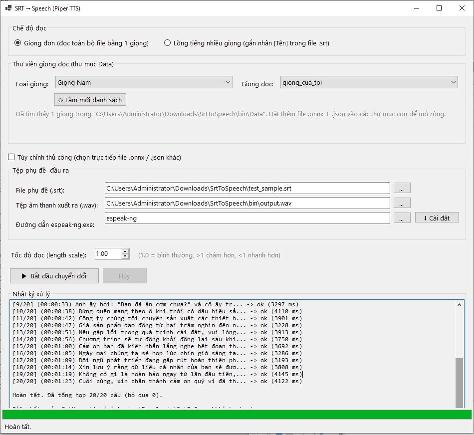

# SrtToSpeech

<p align="center">
  
</p>


Ứng dụng Windows (WinForms) đọc file phụ đề `.srt` và tổng hợp giọng nói bằng mô hình **Piper TTS**, xuất ra 1 file `.wav` với lời thoại đặt đúng mốc thời gian của từng dòng phụ đề.

Hỗ trợ:
- Thư viện nhiều giọng đọc (Nam / Nữ / mở rộng thêm tùy ý)
- Chế độ lồng tiếng nhiều giọng bằng nhãn `[Tên]` ngay trong file `.srt`
- Chỉnh tốc độ đọc (length scale)
- Tự động tải và cài đặt **eSpeak NG** ngay trong app (không cần tải thủ công)

> Đây là ứng dụng WinForms (`net9.0-windows`) nên **chỉ build và chạy được trên Windows**.

---

## 1. Cấu trúc thư mục

```
SrtToSpeech/
├── src/                        ← Toàn bộ mã nguồn (.vb, .vbproj)
│   ├── SrtToSpeech.vbproj
│   ├── Program.vb              ← Điểm vào (Sub Main)
│   ├── MainForm.vb             ← Giao diện chính + toàn bộ logic UI
│   ├── SrtParser.vb            ← Đọc/parse file .srt
│   ├── PiperVoice.vb           ← Gọi mô hình Piper TTS (ONNX) + eSpeak NG
│   ├── WavFile.vb              ← Ghi/ghép file .wav
│   ├── VoiceLibrary.vb         ← Quét thư viện giọng đọc trong Data\
│   └── Data/                   ← Thư viện giọng đọc (.onnx + .json)
│       ├── Male/
│       └── Female/
├── bin/                        ← Nơi xuất ra sau khi build (ban đầu rỗng)
├── restore_nuget.bat           ← B1: tải các gói NuGet cần thiết
├── build.bat                   ← B2: build bản phát hành (self-contained, gộp 1 file .exe)
├── build_dev.bat               ← B2 (thay thế): build nhanh cho dev, không gộp/không self-contained
└── README.md
```

`src` là nơi chỉnh sửa code, `bin` là nơi nhận kết quả build cuối cùng — tách riêng để không lẫn lộn giữa source và binary.

---

## 2. Cài đặt công cụ cần thiết

1. **.NET 9 SDK** (bản Windows): https://dotnet.microsoft.com/download/dotnet/9.0
2. **eSpeak NG** — dùng để phiên âm văn bản tiếng Việt sang IPA trước khi đưa vào mô hình Piper.
   - Từ bản mới nhất, **không cần tải thủ công** — mở app, vào mục *"Tệp phụ đề & đầu ra"*, bấm nút **⬇ Cài đặt** cạnh ô "Đường dẫn espeak-ng.exe". App sẽ tự:
     1. Kiểm tra bản phát hành mới nhất của eSpeak NG trên GitHub
     2. Tải file cài đặt (`.msi`/`.exe`) về
     3. Chạy cài đặt (sẽ hiện hộp thoại UAC xin quyền Quản trị viên — bấm **Yes**)
     4. Tự tìm và điền đường dẫn `espeak-ng.exe` vào ô tương ứng
   - Hoặc tải/cài thủ công tại: https://github.com/espeak-ng/espeak-ng/releases, rồi bấm nút `...` cạnh ô đường dẫn để chọn file `espeak-ng.exe`.

---

## 3. Thêm giọng đọc vào thư viện (trước khi build)

Đặt file `.onnx` + `.json` vào `src\Data\Male\` hoặc `src\Data\Female\` (có thể tạo thêm thư mục loại khác trong `src\Data\` nếu muốn).

Mỗi giọng cần 2 file **cùng tên gốc** (chỉ khác phần đuôi), ví dụ:

```
src\Data\Male\giong_cua_toi.onnx
src\Data\Male\giong_cua_toi.onnx.json
```

Tên file `.json` được nhận diện theo vài kiểu phổ biến: `<tên>.onnx.json` | `<tên>_onnx.json` | `<tên>.json`

---

## 4. Build dự án

Mở Command Prompt tại thư mục gốc `SrtToSpeech\` (nơi có các file `.bat`), chạy lần lượt:

```bat
restore_nuget.bat      REM chỉ cần chạy 1 lần, hoặc khi đổi máy
build.bat              REM build bản phát hành, đóng gói self-contained thành 1 file .exe
```

Có 2 kịch bản build khác nhau, tùy mục đích:

| Script | Khi nào dùng | Đặc điểm |
|---|---|---|
| `build.bat` | Build bản **phát hành** để gửi cho người khác dùng | Self-contained, gộp thành 1 file `.exe` duy nhất — người dùng không cần cài .NET Runtime, nhưng build lâu hơn và file to hơn |
| `build_dev.bat` | Build nhanh khi đang **phát triển/test** | Framework-dependent (chỉ vài file `.dll` cần thiết, không kéo theo runtime), build nhanh hơn nhiều — máy chạy cần cài sẵn **.NET 9 Desktop Runtime** |

Sau khi build xong, mọi thứ nằm sẵn trong thư mục `bin\`:

```
bin\SrtToSpeech.exe
bin\Data\Male\...
bin\Data\Female\...
```

Muốn thêm/bớt giọng **sau khi đã build** mà không cần build lại: chỉ cần thêm thẳng file `.onnx` + `.json` vào `bin\Data\Male` hoặc `bin\Data\Female`, mở app rồi bấm **"Làm mới danh sách"**.

---

## 5. Sử dụng

1. Mở `bin\SrtToSpeech.exe`
2. Chọn chế độ: **"Giọng đơn"** hoặc **"Lồng tiếng nhiều giọng"**
   - *Giọng đơn*: chọn Loại giọng + Giọng đọc trong thư viện
   - *Lồng tiếng*: chọn file `.srt` đã gắn nhãn `[Tên]`, bấm **"Quét nhãn từ file SRT"**, sau đó với mỗi nhãn chọn Loại giọng + Giọng đọc tương ứng
3. Chọn file `.srt` đầu vào và nơi lưu file `.wav` kết quả
4. Chọn đường dẫn `espeak-ng.exe` (hoặc bấm **⬇ Cài đặt** nếu chưa có — xem mục 2)
5. Chỉnh **"Tốc độ đọc"** nếu muốn (1.0 = bình thường, >1 đọc chậm hơn, <1 đọc nhanh hơn)
6. Bấm **"▶ Bắt đầu chuyển đổi"** và theo dõi nhật ký xử lý + thanh tiến trình. Có thể bấm **"Hủy"** bất cứ lúc nào.

### Chế độ lồng tiếng nhiều giọng

Gắn nhãn `[Tên]` ở **đầu** dòng thoại trong file `.srt` — vẫn là file `.srt` bình thường, mở được bởi bất kỳ trình phụ đề nào khác:

```srt
12
00:00:12,000 --> 00:00:14,500
[Nam] Anh nghĩ sao về chuyện này?

13
00:00:15,000 --> 00:00:17,000
[Nữ] Tôi nghĩ là được đó.
```

Dòng **không** có nhãn `[Tên]` sẽ dùng giọng **"(mặc định)"**. Tên nhãn tùy ý, không bắt buộc phải là "Nam"/"Nữ" (ví dụ `[Bà A]`, `[Ông B]`...), miễn là bạn gán đúng giọng cho nó trong bảng sau khi quét.

---

## 6. Lưu ý

- Nếu 1 câu thoại được tổng hợp dài hơn thời lượng hiển thị của dòng phụ đề đó, chương trình vẫn giữ nguyên độ dài giọng nói (không cắt bớt) và sẽ cảnh báo trong nhật ký vì có thể chồng lấn sang câu kế tiếp. Bạn có thể tăng "Tốc độ đọc" (>1) để đọc nhanh hơn cho khớp thời lượng.
- Đây là bản tự xây dựng việc phiên âm (không dùng thư viện `piper-phonemize` gốc) nên chất lượng phát âm có thể khác một chút so với Piper chính thức, nhất là với từ vay mượn/ký tự đặc biệt.
- Việc cài eSpeak NG qua nút **⬇ Cài đặt** cần máy có kết nối mạng tới `github.com`/`api.github.com` và cần xác nhận hộp thoại UAC (quyền Quản trị viên) để cài vào `Program Files`.

---

## 7. Xử lý lỗi thường gặp (Troubleshooting)

**`vbc : error BC30420: 'Sub Main' was not found in 'SrtToSpeech.Program'`**
→ Do namespace bị lồng đôi (`RootNamespace` mặc định trùng với `Namespace SrtToSpeech` khai báo thủ công trong các file `.vb`). Đã khắc phục bằng cách bỏ khối `Namespace ... End Namespace` khỏi toàn bộ file trong `src\`.

**Build ra quá nhiều file `.dll` dù đã dùng `build_dev.bat`**
→ Do `.vbproj` có sẵn `SelfContained=true` + `RuntimeIdentifier=win-x64` áp dụng cho cả `dotnet build`. `build_dev.bat` đã ép override bằng `-p:SelfContained=false -p:RuntimeIdentifier=` để build kiểu framework-dependent, gọn nhẹ hơn.

**`An error occurred trying to start process 'espeak-ng'... The system cannot find the file specified.`**
→ Máy chưa cài eSpeak NG hoặc đường dẫn chưa đúng. Dùng nút **⬇ Cài đặt** trong app (mục 2), hoặc trỏ thủ công tới file `espeak-ng.exe` bằng nút `...` cạnh ô đường dẫn.
